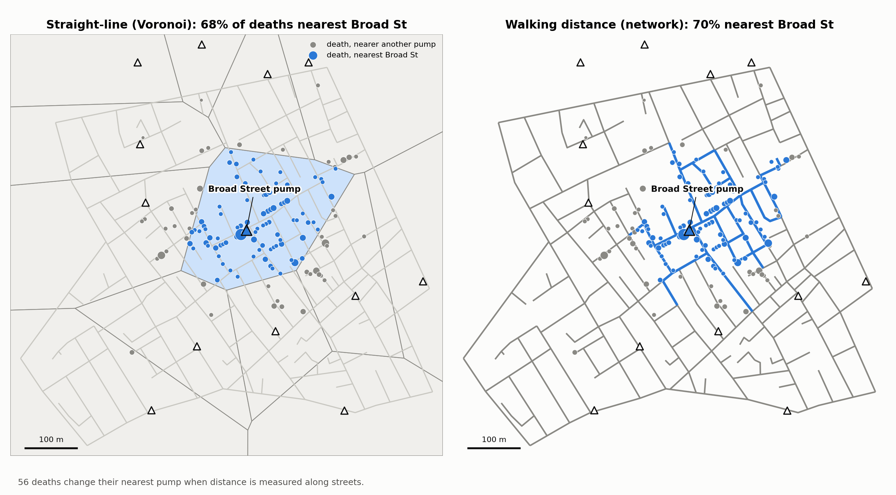

# Spatial Evidence Lab

Three reproducible GIS studies about a single practical question: when does
space change the conclusion? Each module is a standalone CPU-only Python
workflow with figures, machine-readable outputs, and a compact research
narrative.

| Module | Decision question | Spatial evidence |
|---|---|---|
| [01 Network exposure](01-network-exposure/) | Does an accessibility conclusion change when movement follows streets? | projected distances, graph routing, service areas, network null models |
| [02 Multiscale education](02-multiscale-education/) | Are social gradients locally variable or effectively regional? | CRS audit, Moran's I, GWR, MGWR, spatial-scale diagnostics |
| [03 Spatial generalization](03-spatial-generalization/) | How much accuracy survives when prediction sites move away from samples? | variograms, kriging, spatial blocking, buffered validation |

<p>

</p>

## Reproducibility

```bash
git clone https://github.com/Brianzzx7/spatial-evidence-lab.git
cd spatial-evidence-lab
python -m venv .venv
source .venv/bin/activate
pip install -r requirements.txt

python 01-network-exposure/analysis.py
python 02-multiscale-education/analysis.py
python 03-spatial-generalization/analysis.py
```

The workflows were run with Python 3.13 on Apple Silicon. The dependency set is
locked in `requirements.txt`; no API key, GPU, or manual download is required.
Module 03 takes a few minutes because it performs buffered leave-one-out
validation.

## Outputs

Every module writes `outputs/results.json` for automated checks and regenerates
all PNG figures in `figures/`. The JSON files include both core estimates and
portfolio-specific diagnostics:

* Network exposure: assignment disagreement, concentration lift, and observed
  walk-distance reduction against a street-network null model.
* Multiscale education: GWR AICc improvement, residual-dependence reduction,
  and the spread of MGWR spatial scales.
* Spatial generalization: the error penalty caused by spatial blocking and by a
  1 km exclusion buffer.

## Provenance

The studies use openly distributed teaching datasets. Code and data notices,
including the required MIT notice for retained derivative material, are in
[THIRD_PARTY_NOTICES.md](THIRD_PARTY_NOTICES.md). This repository has a new,
independent Git history.

## License

Repository additions are MIT licensed. See [LICENSE](LICENSE) and
[THIRD_PARTY_NOTICES.md](THIRD_PARTY_NOTICES.md).
